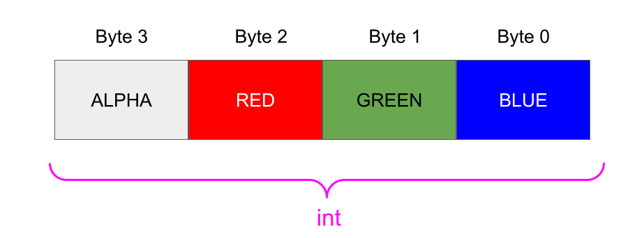
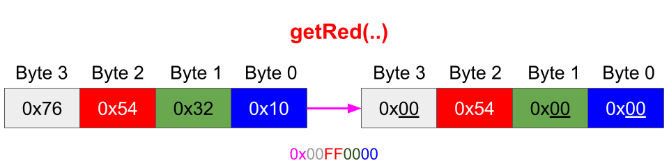
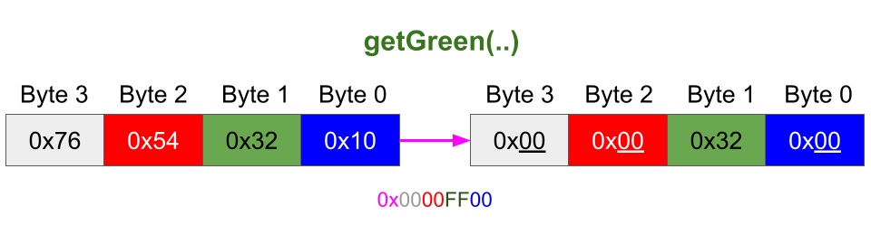
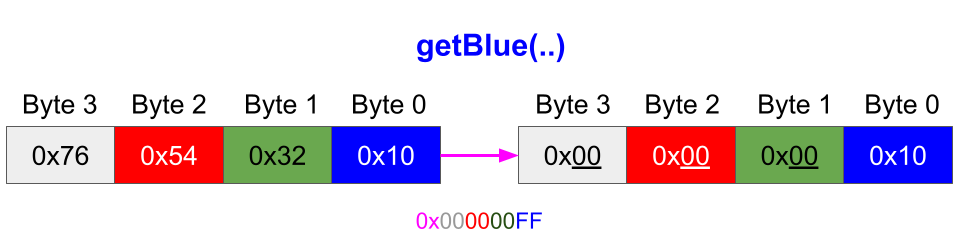
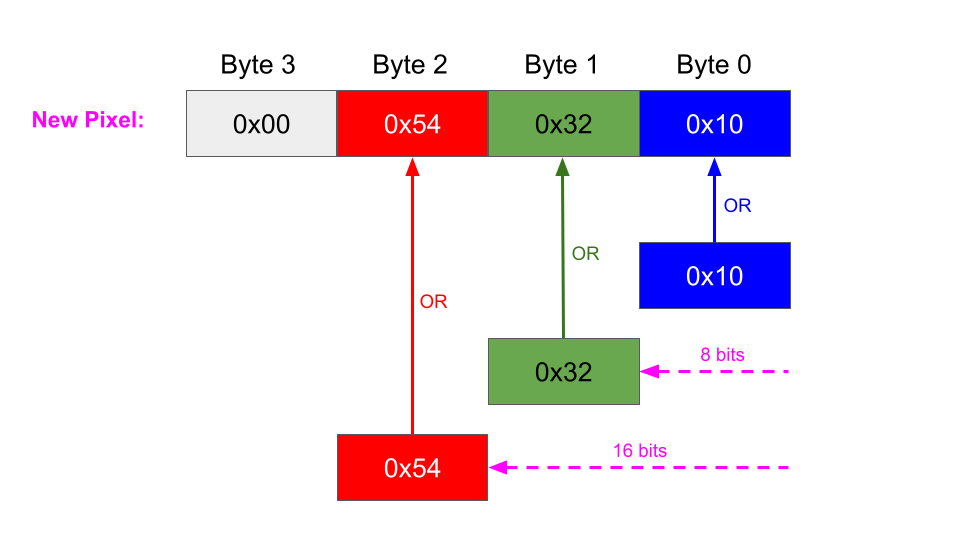
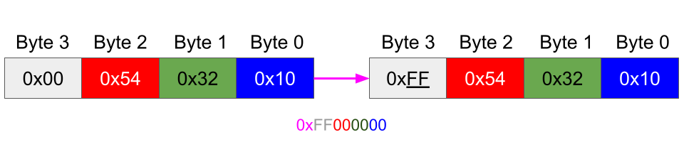

Additional Resource - Image Processing, Color Spaces, Extraction & Manipulation
As I'm always committed to bringing you the most relevant and real-life examples, in the previous lecture we touched upon a few other very important topics beyond Multithreading like color spaces, bit-shifting and binary algebra. Since these topics are very frequently used in the industry (as well as in job interviews), this guide will provide a more in-detail explanation of those parts of the Image Processing Example.

**Pixels and Color Space Background**

In digital imaging, a _Pixel_ represents the smallest element of a picture displayed on the screen.

An image is nothing more than a 2-dimensional collection of Pixels.

The color of a pixel can be encoded in different ways.

A few frequently used groups of pixel color encoding are:

Y'UV - Luma (brightness), and 2 chroma (color) components

RGB - Red, Green, Blue

HSL and HSV - Hue, Saturation, Lightness/Brightness

CIE XYZ  - Device independent Red, Green and Blue

ARGB Memory Representation
The format used in our Image Processing example is a version of the RGB family called ARGB, where A stands for alpha (transparency)

The representation of this color in memory is as follows:

As we can see, each component is represented by 1 byte (8 bits) so the value of each component is in the range of 0 (0x in hexadecimal) and 255 (0xFF in hexadecimal)

Since we have 4 bytes, we can store the entire color of a pixel in a variable of type int.

Component Extraction Code Explanation
In the Image Processing example we have the following methods that extract individual components of a pixel:

`public static int getRed(int rgb) {
return (rgb & 0x00FF0000) >> 16;
}
public static int getGreen(int rgb) {
return (rgb & 0x0000FF00) >> 8;
}
public static int getBlue(int rgb) {
return rgb & 0x000000FF;
}`

Let's explain each method, in particular the math that happens to get each color component.

In order to get a particular component (red, green, or blue), we need to first get rid of all the other color components in the pixel, while keeping the desired component.

To achieve this we apply a bitmask.

A bitmask defines which bits we want to keep, and which bits we want to clear.

We apply a bitwise AND with 0x00 (0000 0000 in binary) to get rid of a component since X AND 0 = 0, for any X.

We apply a bitwise AND with 0xFF (1111 1111 in binary) to keep the value of a component since X AND 1 = X, for any X.

However, after applying a bitmask we are not done. We still need to shift the byte representing our component to the lowest byte.

For example in the getRed(..) method, after we apply the bitmask on 0x76543210 we end up with 0x00540000, but what we need is 0x00000054

So we need to shift all the bits in the result of the bitmask to the right., using the >> operator.

For the blue color extraction, we don't need to perform any shifting since it's already the right-most byte.

For the green color extraction, we need to move all the bits 1 byte (8 bits) to the right.

For the red color extraction, we need to move all the bits 2 bytes (16 bits) to the right.

Combining Color Components into a Pixel
When building a pixel's color from individual red, green and blue components we had the following method:

`public static int createRGBFromColors(int red, int green, int blue) { 
    int rgb = 0;
    rgb |= blue;
    rgb |= green << 8;
    rgb |= red << 16;
     rgb |= 0xFF000000;
    return rgb;
}`

In the above code, we perform the opposite of color component extraction. We take each component and shift it to the right place in the ARGB pixel representation.

Blue is placed at the lowest byte so we simply bitwise OR the pixel color representation with the blue component

Green needs to be placed at the second byte so it is first shifted 1 byte (8 bits) to the left, and then is bitwise ORed with the pixel color

Similarly, red needs to be placed at the third byte so its component is shifted 2 bytes (16 bits) to the left, and then it is bitwise ORed with the pixel color

The final step is to set the transparency level to the highest, making the color completely opaque (0 levels mean fully transparent, 255 means fully opaque).

That is achieved by setting the left-most byte, representing the alpha component to 0xFF which is 1111 1111 in binary.

