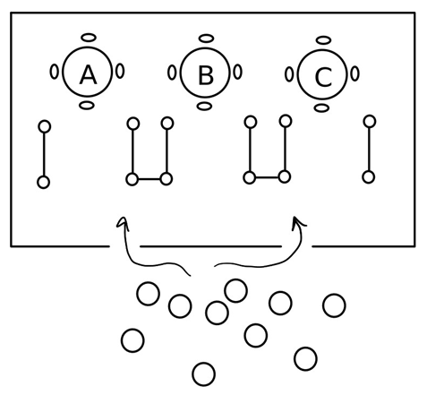

Restaurant Management

https://www.programminghomeworkhelp.com/restaurant-management-in-java/ 

Imagine there is a restaurant with three tables. Table A serves seafood, table B serves steak, and table C serves pasta. Each table can fit four people. Everyone must choose the table they want to eat at, and stand in its line. Each customer has an idea of which table they want to eat at, and may have a backup choice in case it is too busy. When the customer enters the restaurant through one of its two doors (which fit one person at a time) they look at the lines for the tables they want. If their first choice has a long line (7 or more) they will choose their second choice (if they have one) if it is not also long. Otherwise, they will always choose their first choice. Once their table is chosen, the customers stand in line for that table getting one of the four seats when it is their turn. After the customer sits at the table, they will call the waiter. The waiter will go to the table to take the order, go to the kitchen to deliver the order, and after some time will bring the order back to the table. The customers at the table will then eat, leave the table, pay, and then leave the restaurant.

You should program a single application in c,c++, java, or python. The program will simulate the restaurant using threads for the waiters and customers. If you program in c or c++, use pthreads and POSIX semaphores. If your program in java uses the Thread and Semaphore classes. If you use python, use the threading module, and threading. Semaphore for synchronization.

You should set up the simulation and then launch 3 waiter threads followed by 40 customer threads. At creation, each thread will be given an id that uniquely distinguishes it from other threads of the same type (waiter or customer). You will need some shared variables to exchange information and synchronization. In particular, several semaphores must be used to synchronize the behavior of the threads.

Both the waiter and the customer will have times it will wait. The wait time is given as a range. You should randomly select a time within the range when you reach that step.

The Waiter

1. The waiter chooses a table. Only one waiter can wait at each table.

2. The waiter waits for a customer from his table to call him.

3. Once called, the waiter goes to the customer, and informs the customer he is ready to take the order

4. The waiter gets the customer’s id (represents getting the order)

5. The waiter goes to the kitchen. Only one waiter can use the kitchen at a time. He will spend 100 to 500 milliseconds in the kitchen to deliver the order.

6. The waiter waits outside the kitchen for the order to be ready (this will be between 300 milliseconds to 1 second)

7. The waiter will go to the kitchen to get the order. He will spend 100 to 500 milliseconds in the kitchen.

8. The waiter will bring the customer the order

9. The waiter will wait for the next customer

10. When the last customer leaves the restaurant, the waiter will clean the table, and leave the restaurant.

The Customer

1. The customer chooses a table to eat at

2. The customer may choose a backup table to eat at (randomly decide this)

3. The customer enters the restaurant through one of the two doors. Each door allows one customer to enter at a time.

4. The customer looks at the lines for the chosen tables.

• A line is long if there are 7 or more customers in it. You will need to keep a shared counter.

• If the first choice’s line is long, but the second choice’s line is not, then the customer will go to the second choice table

• Otherwise, the customer will go to the first choice table

• If there is no second choice, the customer will always go to the first choice table

5. Once the table is chosen, the customer will stand in the corresponding line to wait for an empty seat

6. There are four seats. Whenever a seat is empty the next customer in line leaves the line to sit down.

• The seats will start empty. So, the first four customers in line will not need to wait.

7. When the customer sits down, it will call the waiter for this table, and wait.

8. When the waiter comes to take the order, the customer will give the waiter its id (representing giving the order), and wait for the order

9. When the waiter brings the order, the customer will eat the food. This will take 200 milliseconds to 1 second.

10. Afterwards the customer will leave the table. This means the seat has now become empty.

11. The customer will then pay the bill. Only one customer can pay at a time.

12. The customer leaves the restaurant. The client thread will then exit.

Output

Every thread should print out what it is doing as it does it. Each step listed in the above subsections needs a line printed. Each line should contain what type of thread it is (waiter or customer) and its id (within its type). If the action is an interaction with the other type of thread it should also print out that information. As an example, when the waiter takes the customer’s order, your program may print out something like:

Waiter 0 takes Customer 7’s order.

When the customer gives its order to the waiter your program may print out something like:

Customer 7 gives the order to Waiter 0.

The order of the message is only restricted by the order the actions must take place in, given in the previous two subsections. Due to the nature of threads, without using a synchronization mechanism like semaphores, we cannot control the order in which these actions will happen. So, the waiter should not take an order before going to the table, but it is ok if waiter 2 takes customer 30’s order before waiter 0 takes customer 7’s.